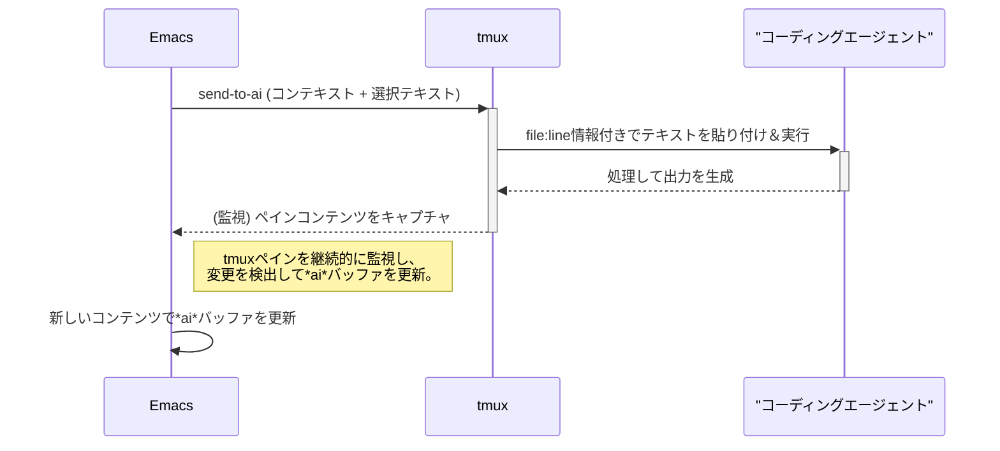

# emacs-ai-agent-bridge

*他の言語で読む: [English](README.md)*

tmuxで実行されているAIコーディングエージェントとEmacsを橋渡しするEmacs拡張機能。

## 機能

- **自動tmux監視**: tmuxセッションを2秒ごとに監視
- **スマートなプロンプト検出**: コンテンツの変化を監視してAIエージェントのプロンプト状態を検出
- **非侵入型バッファ表示**: フォーカスを奪わずに*ai*バッファを表示
- **1回限りの通知**: プロンプト検出ごとに1回だけバッファを表示
- **簡単なテキスト送信**: 選択した領域を自動実行付きでAIエージェントに送信
- **コンテキスト認識**: 送信テキストにファイルパスと行番号を自動的に含める

## インストール

1. `emacs-ai-agent-bridge.el`をEmacsのロードパスに配置
2. Emacsの設定に以下を追加:
   ```elisp
   (require 'emacs-ai-agent-bridge)
   ```

### クイックスタート設定

Emacs起動時に自動的に監視を開始するには:
```elisp
(require 'emacs-ai-agent-bridge)
(emacs-ai-agent-bridge-start-monitoring)
```

### 完全な設定例

```elisp
;; パッケージをロード
(require 'emacs-ai-agent-bridge)

;; オプション: 設定をカスタマイズ
(setq emacs-ai-agent-bridge-tmux-session nil)  ; セッションを自動検出
(setq emacs-ai-agent-bridge-tmux-pane "0")     ; ペイン0を監視
(setq emacs-ai-agent-bridge-monitor-interval 2) ; 2秒ごとにチェック

;; 自動的に監視を開始
(emacs-ai-agent-bridge-start-monitoring)

;; オプション: テキスト送信用のキーバインディングを設定
(global-set-key (kbd "C-c a s") 'send-to-ai)

;; オプション: @ai入力モードをグローバルまたは特定のモードで有効化
;; (emacs-ai-agent-bridge-input-mode 1)  ; グローバルに有効化
;; (add-hook 'text-mode-hook 'emacs-ai-agent-bridge-input-mode)  ; テキストモードで有効化

;; 推奨: AIエージェントによって変更されたファイルを自動的に
;; リロードするためにauto-revertモードを有効化
(global-auto-revert-mode 1)  ; 外部で変更されたファイルを自動的にリロード

;; 注意: WSL環境では、以下の設定も必要な場合があります:
;; (setq auto-revert-use-notify nil)
```

## 使用方法

### AIエージェントへのテキスト送信

#### 方法1: 選択した領域を送信
1. テキスト領域を選択
2. 実行:
   ```
   M-x send-to-ai
   ```
   または完全な関数名を使用:
   ```
   M-x emacs-ai-agent-bridge-send-region-to-tmux
   ```

#### 方法2: インライン@aiコマンド
まず入力モードを有効化:
```
M-x emacs-ai-agent-bridge-input-mode
```

その後、@aiプレフィックスを使用してクイックプロンプトを入力できます:

**単一行プロンプト:**
```
@ai フランスの首都は何ですか？ [Enter]
```
@aiの後のテキストがAIエージェントに送信され、その行は削除されます。AIエージェントは、現在のファイルと行番号に関するコンテキスト情報と共にプロンプトを受信します。

**複数行プロンプト:**
```
@ai-begin
これは複数行のプロンプトです。
ここに複数行を書くことができます。
各行がプロンプトの一部として送信されます。
@ai-end [この行でEnter]
```
@ai-end行でEnterを押すと、ブロック全体（@ai-beginと@ai-endマーカーを除く）がAIエージェントに送信され、ブロックは削除されます。AIエージェントは、コンテキスト情報（ファイル名と@ai-begin行の行番号）の後に複数行のコンテンツを受信します。

### AIエージェントのプロンプトへの応答
AIエージェントが*ai*バッファに複数の選択肢を表示した場合、数字キーを使用して素早く応答できます:

1. *ai*バッファにフォーカスを移動（例: クリックして）
2. 選択に対応する数字キーを押す:
   - `1`を押して最初のオプションを選択
   - `2`を押して2番目のオプションを選択
   - `3`を押して3番目のオプションを選択
   - `4`を押して4番目のオプションを選択
   - `5`を押して5番目のオプションを選択
   - `Enter` (C-m)を押して最初のオプションを選択（デフォルトの選択）

プロンプトの例:
```
╭───────────────────────────────────────────────────────────────────────────────────────╮
│ Do you want to proceed?                                                                │
│ ❯ 1. Yes                                                                              │
│   2. Yes, and don't ask again for find commands                                        │
│   3. No, and tell Claude what to do differently (esc)                                 │
╰───────────────────────────────────────────────────────────────────────────────────────╯
```

*ai*バッファで`1`、`2`、`3`、`4`、または`5`を押すだけで、選択をAIエージェントに送信できます。また、`Enter`を押して最初のオプションを素早く選択することもできます。

### 監視の停止
```
M-x emacs-ai-agent-bridge-stop-monitoring
```

### ステータスの確認
```
M-x emacs-ai-agent-bridge-monitor-status
```

## 設定

```elisp
;; 監視するtmuxセッション（nilで自動検出）
(setq emacs-ai-agent-bridge-tmux-session nil)

;; 監視するペインID（デフォルト: "0"）
(setq emacs-ai-agent-bridge-tmux-pane "0")

;; 監視間隔（秒）（デフォルト: 2）
(setq emacs-ai-agent-bridge-monitor-interval 2)
```

## 動作の仕組み

1. **監視**: 拡張機能はtmuxコンソールのコンテンツを2秒ごとに監視
2. **検出**: コンテンツが変更されない場合、AIエージェントが入力を待っていると判断
3. **通知**: プロンプトが検出されると*ai*バッファが1回表示される
4. **フォーカス**: *ai*バッファが表示されても、現在のバッファにフォーカスが保持される
5. **送信**: 選択したテキストがtmuxに送信され、その後Enterキー（C-m）で実行される

## 要件

- Emacs 25.1以降
- tmux
- tmuxで実行されているAIコーディングエージェント（例: Claude Code）

## システムアーキテクチャ



## ライセンス

GPL v3
