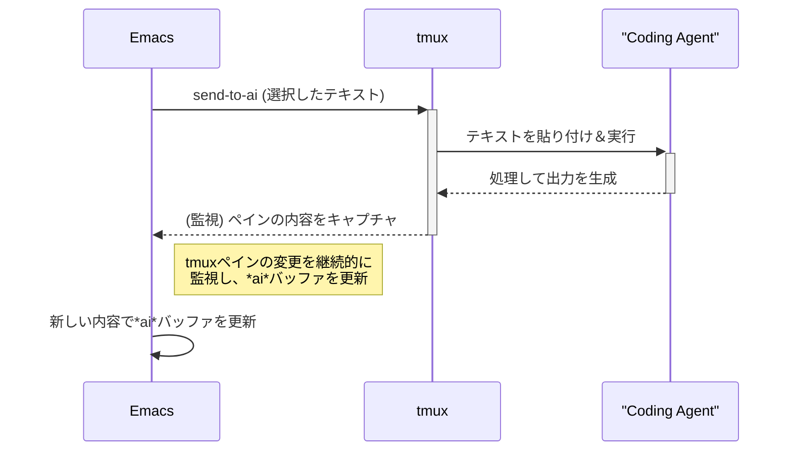

# emacs-ai-agent-bridge

*他の言語で読む: [English](README.md)*

tmuxで実行されているAIコーディングエージェントとEmacsを橋渡しするEmacs拡張機能です。

## 機能

- **自動tmux監視**: tmuxセッションを2秒ごとに監視
- **スマートなプロンプト検出**: コンテンツの変化を監視してAIエージェントのプロンプト状態を検出
- **非侵入的なバッファ表示**: フォーカスを奪わずに*ai*バッファを表示
- **一度だけの通知**: プロンプト検出ごとに一度だけバッファを表示
- **簡単なテキスト送信**: 選択したリージョンを自動実行付きでAIエージェントに送信

## インストール

1. `emacs-ai-agent-bridge.el`をEmacsのロードパスに配置
2. Emacsの設定に以下を追加:
   ```elisp
   (require 'emacs-ai-agent-bridge)
   ```

### クイックスタート設定

Emacs起動時に自動的に監視を開始するには:
```elisp
(require 'emacs-ai-agent-bridge)
(emacs-ai-agent-bridge-start-monitoring)
```

### 完全な設定例

```elisp
;; パッケージをロード
(require 'emacs-ai-agent-bridge)

;; オプション: 設定をカスタマイズ
(setq emacs-ai-agent-bridge-tmux-session nil)  ; セッションを自動検出
(setq emacs-ai-agent-bridge-tmux-pane "0")     ; ペイン0を監視
(setq emacs-ai-agent-bridge-monitor-interval 2) ; 2秒ごとにチェック

;; 自動的に監視を開始
(emacs-ai-agent-bridge-start-monitoring)

;; オプション: テキスト送信用のキーバインディングを設定
(global-set-key (kbd "C-c a s") 'send-to-ai)
```

## 使い方

### AIエージェントへテキストを送信
1. テキストリージョンを選択
2. 実行:
   ```
   M-x send-to-ai
   ```
   または完全な関数名を使用:
   ```
   M-x emacs-ai-agent-bridge-send-region-to-tmux
   ```

### AIエージェントのプロンプトに応答
AIエージェントが*ai*バッファに複数の選択肢を提示した場合、数字キーを使って素早く応答できます:

1. *ai*バッファにフォーカスを移動（クリックなどで）
2. 選択に対応する数字キーを押す:
   - `1`を押して最初のオプションを選択
   - `2`を押して2番目のオプションを選択  
   - `3`を押して3番目のオプションを選択
   - `4`を押して4番目のオプションを選択
   - `5`を押して5番目のオプションを選択
   - `Enter` (C-m)を押して最初のオプションを選択（デフォルトの選択）

プロンプトの例:
```
╭───────────────────────────────────────────────────────────────────────────────────────╮
│ Do you want to proceed?                                                                │
│ ❯ 1. Yes                                                                              │
│   2. Yes, and don't ask again for find commands                                        │
│   3. No, and tell Claude what to do differently (esc)                                 │
╰───────────────────────────────────────────────────────────────────────────────────────╯
```

*ai*バッファで`1`、`2`、`3`、`4`、または`5`を押すだけで、選択をAIエージェントに送信できます。また、`Enter`を押すことで素早く最初のオプションを選択できます。

### 監視を停止
```
M-x emacs-ai-agent-bridge-stop-monitoring
```

### ステータスを確認
```
M-x emacs-ai-agent-bridge-monitor-status
```

## 設定

```elisp
;; 監視するtmuxセッション（nilで自動検出）
(setq emacs-ai-agent-bridge-tmux-session nil)

;; 監視するペインID（デフォルト: "0"）
(setq emacs-ai-agent-bridge-tmux-pane "0")

;; 監視間隔（秒）（デフォルト: 2）
(setq emacs-ai-agent-bridge-monitor-interval 2)
```

## 動作の仕組み

1. **監視**: 拡張機能は2秒ごとにtmuxコンソールの内容を監視
2. **検出**: 内容が変化しない場合、AIエージェントが入力を待っていると判断
3. **通知**: プロンプトが検出されたときに*ai*バッファが一度表示される
4. **フォーカス**: *ai*バッファが表示されても、現在のバッファがフォーカスを保持
5. **送信**: 選択したテキストがtmuxに送信され、実行のためにEnterキー（C-m）が送信される

## 必要要件

- Emacs 25.1以降
- tmux
- tmuxで実行されているAIコーディングエージェント（例：Claude Code）

## システムアーキテクチャ



## ライセンス

GPL v3