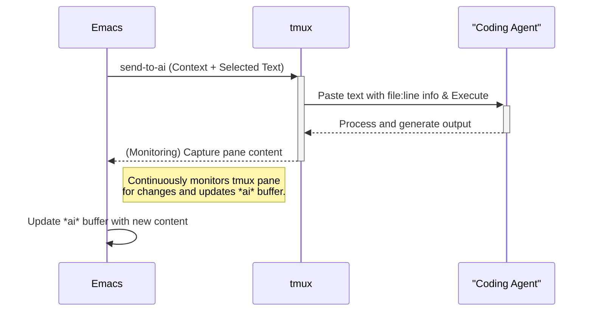

# emacs-ai-agent-bridge

*Read this in other languages: [日本語](README.ja.md)*

An Emacs extension that bridges an AI coding agent running in tmux with Emacs.

## Features

- **Automatic tmux monitoring**: Monitor tmux session every 2 seconds
- **Smart prompt detection**: Detect AI agent prompt state by monitoring content changes
- **Non-intrusive buffer display**: Show *ai* buffer without stealing focus
- **One-time notification**: Display buffer only once per prompt detection
- **Easy text sending**: Send selected region to AI agent with automatic execution
- **Context awareness**: Automatically includes file path and line number with sent text

## Installation

1. Place `emacs-ai-agent-bridge.el` in your Emacs load path
2. Add to your Emacs configuration:
   ```elisp
   (require 'emacs-ai-agent-bridge)
   ```

### Quick Start Configuration

To automatically start monitoring when Emacs starts:
```elisp
(require 'emacs-ai-agent-bridge)
(emacs-ai-agent-bridge-start-monitoring)
```

### Full Configuration Example

```elisp
;; Load the package
(require 'emacs-ai-agent-bridge)

;; Optional: Configure settings
(setq emacs-ai-agent-bridge-tmux-session nil)  ; auto-detect session
(setq emacs-ai-agent-bridge-tmux-pane "0")     ; monitor pane 0
(setq emacs-ai-agent-bridge-monitor-interval 2) ; check every 2 seconds

;; Start monitoring automatically
(emacs-ai-agent-bridge-start-monitoring)

;; Optional: Set up key binding for sending text
(global-set-key (kbd "C-c a s") 'send-to-ai)

;; Optional: Enable @ai input mode globally or for specific modes
;; (emacs-ai-agent-bridge-input-mode 1)  ; Enable globally
;; (add-hook 'text-mode-hook 'emacs-ai-agent-bridge-input-mode)  ; Enable for text modes

;; Recommended: Enable auto-revert mode to automatically reload files
;; modified by the AI agent
(global-auto-revert-mode 1)  ; Automatically reload files when changed externally

;; Note: In WSL environments, you may also need to add:
;; (setq auto-revert-use-notify nil)
```

## Usage

### Send Text to AI Agent

#### Method 1: Send Selected Region
1. Select text region
2. Execute:
   ```
   M-x send-to-ai
   ```
   Or use the full function name:
   ```
   M-x emacs-ai-agent-bridge-send-region-to-tmux
   ```

#### Method 2: Send Consecutive Lines Block (C-c <return>)
Press `C-c <return>` (Control+C followed by Return) to send consecutive lines before the cursor to the AI agent. The function will:
- Send all consecutive non-blank lines before the cursor
- Stop at the first blank line or beginning of buffer
- Include context information (file name and line number)

Example:
```
First line of text
Second line of text
Third line of text  [cursor here]

Previous paragraph (won't be sent)
```
Pressing `C-c <return>` with the cursor on the third line will send all three lines to the AI agent.

#### Method 3: Inline @ai Commands
Enable the input mode first:
```
M-x emacs-ai-agent-bridge-input-mode
```

Then you can use @ai prefix for quick prompts:

**Single line prompt:**
```
@ai What is the capital of France? [Enter]
```
The text after @ai will be sent to the AI agent and the line will be deleted. The AI agent will receive the prompt with context information about the current file and line number.

**Multi-line prompt:**
```
@ai-begin
This is a multi-line prompt.
You can write multiple lines here.
Each line will be sent as part of the prompt.
@ai-end [Enter on this line]
```
When you press Enter on the @ai-end line, the entire block (excluding @ai-begin and @ai-end markers) will be sent to the AI agent and the block will be deleted. The AI agent will receive the context information (file name and line number of the @ai-begin line) followed by your multi-line content.

### Respond to AI Agent Prompts
When the AI agent presents multiple choice options in the *ai* buffer, you can respond quickly using number keys:

1. Focus on the *ai* buffer (e.g., by clicking on it)
2. Press the number key corresponding to your choice:
   - Press `1` to select the first option
   - Press `2` to select the second option  
   - Press `3` to select the third option
   - Press `4` to select the fourth option
   - Press `5` to select the fifth option
   - Press `Enter` (C-m) to select the first option (default choice)

Example prompt:
```
╭───────────────────────────────────────────────────────────────────────────────────────╮
│ Do you want to proceed?                                                                │
│ ❯ 1. Yes                                                                              │
│   2. Yes, and don't ask again for find commands                                        │
│   3. No, and tell Claude what to do differently (esc)                                 │
╰───────────────────────────────────────────────────────────────────────────────────────╯
```

Simply press `1`, `2`, `3`, `4`, or `5` in the *ai* buffer to send your selection to the AI agent. You can also press `Enter` to quickly select the first option.

### Stop Monitoring
```
M-x emacs-ai-agent-bridge-stop-monitoring
```

### Check Status
```
M-x emacs-ai-agent-bridge-monitor-status
```

## Configuration

```elisp
;; tmux session to monitor (nil for auto-detect)
(setq emacs-ai-agent-bridge-tmux-session nil)

;; Pane ID to monitor (default: "0")
(setq emacs-ai-agent-bridge-tmux-pane "0")

;; Monitoring interval in seconds (default: 2)
(setq emacs-ai-agent-bridge-monitor-interval 2)
```

## How It Works

1. **Monitoring**: The extension monitors tmux console content every 2 seconds
2. **Detection**: When content remains unchanged, it assumes the AI agent is waiting for input
3. **Notification**: The *ai* buffer is displayed once when a prompt is detected
4. **Focus**: Your current buffer remains focused while the *ai* buffer is shown
5. **Sending**: Selected text is sent to tmux followed by Enter key (C-m) for execution

## Requirements

- Emacs 25.1 or later
- tmux
- AI coding agent running in tmux (e.g., Claude Code)

## System Architecture



## License

GPL v3
